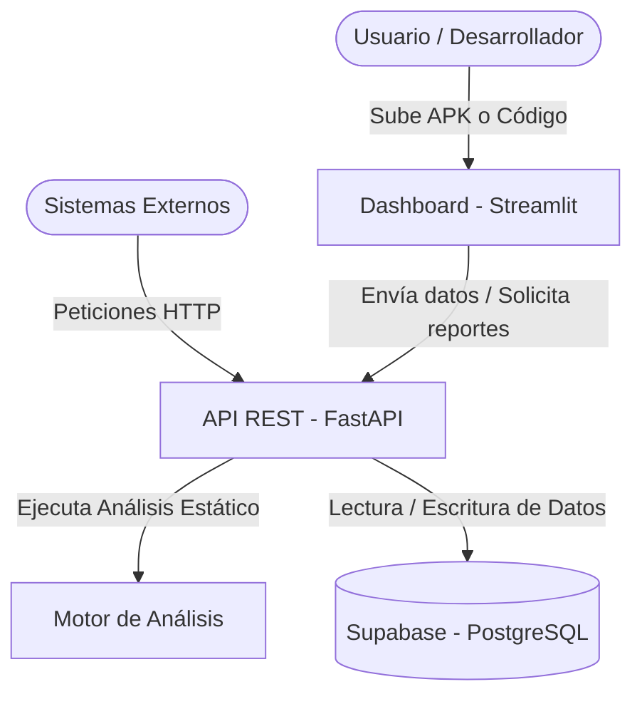

# AnzenCore

AnzenCore es un analizador de vulnerabilidades móviles y calidad de código. El flujo principal permite analizar proyectos, aplicar análisis estático, registrar hallazgos en Supabase PostgreSQL y exportar reportes. También ofrece una API para análisis de repositorios de GitHub y carpetas locales.

## Objetivos del Proyecto

- **Análisis Automatizado:** Proveer un mecanismo rápido y automatizado para la detección de vulnerabilidades, *code smells* y métricas de complejidad.
- **Integración Continua:** Facilitar a otros servicios y microservicios externos la capacidad de analizar repositorios y carpetas sin requerir autenticación para esos flujos (*stateless*).
- **Visualización Centralizada:** Permitir a los desarrolladores visualizar y gestionar los hallazgos mediante un dashboard interactivo.

## Stack Tecnológico

El proyecto está construido utilizando las siguientes tecnologías:

- **Frontend / Dashboard:** [Python](https://www.python.org/) y [Streamlit](https://streamlit.io/) (Arquitectura MVC).
- **Backend / API REST:** [Python](https://www.python.org/) y [FastAPI](https://fastapi.tiangolo.com/).
- **Base de Datos:** [PostgreSQL](https://www.postgresql.org/) mediante [Supabase](https://supabase.com/).
- **Infraestructura / Despliegue:** [Docker](https://www.docker.com/), [Terraform](https://www.terraform.io/) y [Azure Container Apps](https://azure.microsoft.com/en-us/products/container-apps/).
- **CI/CD & DevSecOps:** [GitHub Actions](https://github.com/features/actions), [SonarQube](https://www.sonarsource.com/), [Semgrep](https://semgrep.dev/) y [Snyk](https://snyk.io/).
- **Testing:** [Pytest](https://docs.pytest.org/) (Unitario/Integración), [Behave](https://behave.readthedocs.io/) (BDD) y [Mutmut](https://mutmut.readthedocs.io/) (Mutación).

## Arquitectura

A continuación se muestra el diagrama conceptual de la solución:



## Requisitos

- Python 3.12.
- Cuenta Supabase con la base de datos creada en el panel web.
- Secrets locales en `.streamlit/secrets.toml`.
- Para despliegue: Azure, Terraform y GitHub Secrets.

## Variables

Local Streamlit:

```toml
SUPABASE_URL = "https://tu-proyecto.supabase.co"
SUPABASE_KEY = "tu_anon_key"
```

API y contenedores:

```text
SUPABASE_URL
SUPABASE_KEY
```

GitHub Actions:

```text
SONAR_TOKEN
SNYK_TOKEN
SEMGREP_APP_TOKEN
AZURE_CLIENT_ID
AZURE_CLIENT_SECRET
AZURE_TENANT_ID
AZURE_SUBSCRIPTION_ID
SUPABASE_URL
SUPABASE_KEY
```

## Instalacion Local

```powershell
python -m venv .venv
.\.venv\Scripts\Activate.ps1
python -m pip install --upgrade pip
python -m pip install -r requirements.txt
```

## Ejecutar Dashboard

```powershell
streamlit run app.py
```

URL local:

```text
http://localhost:8501
```

## Ejecutar API

```powershell
uvicorn app.api.main:app --reload --port 8000
```

Endpoints principales:

```text
GET  /api/v1/health
POST /api/v1/reports
```

Documentacion OpenAPI local:

```text
http://localhost:8000/docs
```

## Pruebas

```powershell
pytest
pytest --cov=app --cov-report=xml
```

Pruebas BDD:

```powershell
python -m behave tests\bdd
```

Pruebas de interfaz basicas:

```powershell
pytest tests/interface
```

Pruebas mutantes:

```bash
python -m mutmut run --paths-to-mutate app/dashboard/services/report_export_service.py --runner "python -m pytest tests/unit/test_report_export_service.py"
```

Nota: `mutmut` debe ejecutarse en Linux/WSL o en GitHub Actions sobre Ubuntu; no soporta Windows nativo.

## Base de Datos

La base de datos vive en Supabase PostgreSQL y no se versiona dentro del repositorio para evitar exponer estructura interna o configuraciones sensibles.

Tablas requeridas en Supabase:

```text
usuarios
vulnerabilidades
apk_scans
apk_findings
apk_artifacts
apk_permissions
apk_components
report_exports
```

Las credenciales deben configurarse solo como secrets o variables de entorno.

## Docker

Dashboard:

```powershell
docker build -f Dockerfile.dashboard -t anzencore-dashboard .
docker run -p 8501:8501 --env SUPABASE_URL=... --env SUPABASE_KEY=... anzencore-dashboard
```

API:

```powershell
docker build -f Dockerfile.api -t anzencore-api .
docker run -p 8000:8000 --env SUPABASE_URL=... --env SUPABASE_KEY=... anzencore-api
```

## Despliegue

El despliegue oficial se hara con Terraform hacia Azure Container Apps. No se usara Streamlit Cloud como despliegue final.

Ruta:

```text
infra/
```

Comandos base:

```bash
terraform init
terraform fmt -recursive
terraform validate
terraform plan
terraform apply
```

## Roadmap

Ver `docs/roadmap/roadmap.md`.
